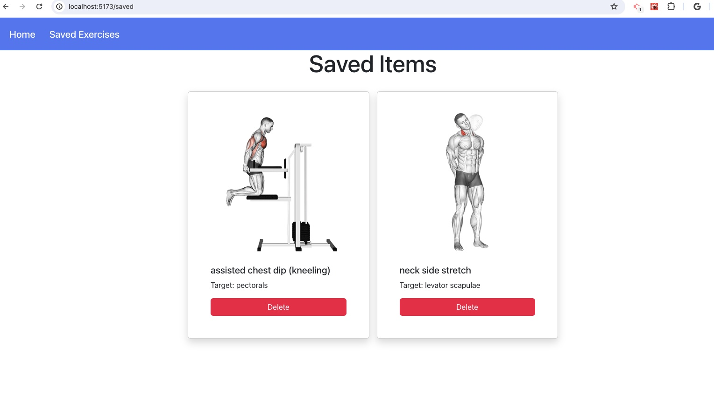

# exerciseXpert-react

## Find your favorite exercise by body part in react app.

## Screenshots

<p align="center">
  
  
</p>

## Table of Contents

- [User Story](#user-story)
- [Acceptance Criteria](#acceptance-criteria)
- [Technologies Used](#technologies-used)
- [Deploy Link](#deploy-link)
- [Installation](#installation)

## User Story

```md
As an fitness enthusiast, I want to find different exercises based on body part names 
so that I can tailor my workouts effectively.

```

## Acceptance Criteria

```md
WHEN I open the exerciseXpert webpage
THEN I view a dropdown to select a body part name

WHEN I select a body part name
AND I click on the search button
THEN I view a list of exercises for that specific body part

WHEN I click the save button on any exercise card
THEN I see an alert indicating the exercise has been saved successfully

WHEN I click the save button again on the same exercise card
THEN I view an alert saying it is already saved

WHEN I navigate to the Saved Exercises page
THEN I view a list of exercises I have saved, each with a delete button

WHEN I click the delete button on any saved exercise card
THEN that specific card is removed from the list of saved exercises
```

## Technologies Used

- React
- React Hooks: useState, useContext
- exercise DB API (extract data for exercises based on body part name and also body parts lists)

## Deploy Link

- Github Repo URL: https://github.com/Najiba-Haidari/exerciseXpert-react
- Netlify URL: https://guileless-chebakia-6ea38c.netlify.app

## Installation

- Fork the respository
- npm install
- npm run dev
  And/or
- Just click on deployed app link.

