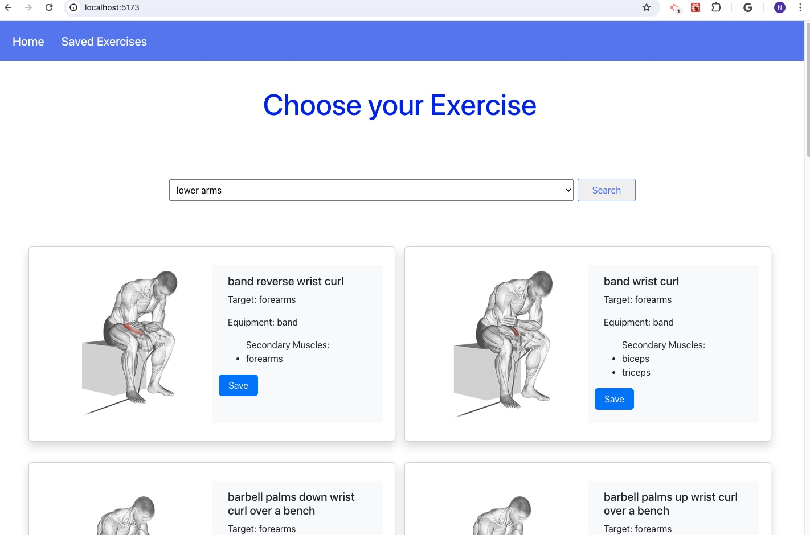

# exerciseXpert-react

## Find your favorite exercise by body part in react app.

## Screenshots

  

## Table of Contents

- [User Story](#user-story)
- [Acceptance Criteria](#acceptance-criteria)
- [Technologies Used](#technologies-used)
- [Deploy Link](#deploy-link)
- [Installation](#installation)
- [License](#license)

## User Story
As a exercise/workout lover, when I use this app, I want to find different exercises based on body part name.

## Acceptance Criteria
WHEN I open the exerciseXpert webpage
THEN I view the dropdown to select the body part name
WHEN I select a body part name
THEN I can click on search button
WHEN I click on search button
THEN I view the list of exercises for that specific body part
WHEN I click the save button on any card
THEN I see the alert for saving successfully
WHEN I click again on save button on the same card
THEN I view the alert saying it is already saved
WHEN I go to Saved Exercises page
THEN I view the exercises I saved with delete button
WHEN I click the delete button on any saved exercise
THEN that specific card is deleted from list of saved items

## Technologies Used

- React
- React Hooks: useState, useContext
- exercise DB API (extract data for exercises based on body part name and also body parts lists)

## Deploy Link

- Github Repo URL: https://github.com/Najiba-Haidari/restful-api

## Installation

- Fork the respository
- npm install
- npm run dev
And/or
- Just click on deployed app link.

## License

This project is under the 
